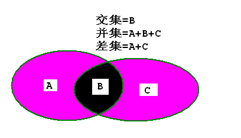

##集合(Set)

**集合的基本性质有一条: 集合中元素是不重复的**

###集合需要有如下方法:

	has(value): 检测集合内是否有某个元素
	add(value): 给集合内添加某个元素
	remove(value): 移除集合中某个元素
	clear(value): 清空集合
	size(): 返回集合长度
	values(): 返回集合转换的数组
	union(otherSet): 返回两个集合的并集
	intersection(otherSet): 返回两个集合的交集
	difference(otherSet): 返回两个集合的差集
	subset(otherSet): 判断该集合是否为传入集合的子集