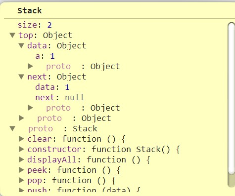

##栈（Stack）是限定仅在表尾进行插入或删除操作的线性表。表尾为栈顶（top），表头为栈底（bottom），不含元素的空表为空栈。

Class Stack = {

	this.top = null;
	this.size = 0;

	push(){}
	peek(){}
	pop(){}
	clear(){}
	displayAll(){}

}

##堆栈可以用链表和数组两种方式实现

##栈的链式表示结构

{ top: { data: { a: 1 }, next: { data: 1, next: null } },size: 2 }

##堆栈的应用
	回溯
	递回
	深度优先搜寻

####数值进制转换
