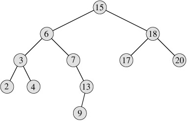

##树

**二叉树的最大特点就在于，它的节点最多只有两个子节点:左侧子节点和右侧子节点。**

二叉搜索树则是二叉树的一种，但它只允许你在左侧节点储存比父节点小的值，右侧只允许储存比父节点大的值。像刚才的这幅图，就是二叉搜索树。

二叉搜索树需要有如下的方法:

	insert(key): 向树中插入一个新的键
	inOrderTraverse(): 通过中序遍历方式，遍历所有节点
	preOrderTranverse(): 通过先序遍历方式，遍历所有节点
	postOrderTranverse(): 通过后序遍历方式，遍历所有节点
	min(): 返回树中最小的值
	max(): 返回树中最大的值
	search(key): 搜索某个值，在树中则返回true
	remove(key): 从树中移除某个键