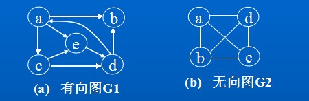
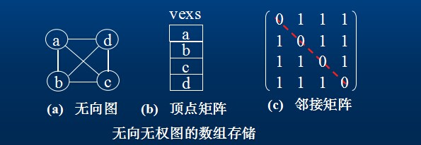
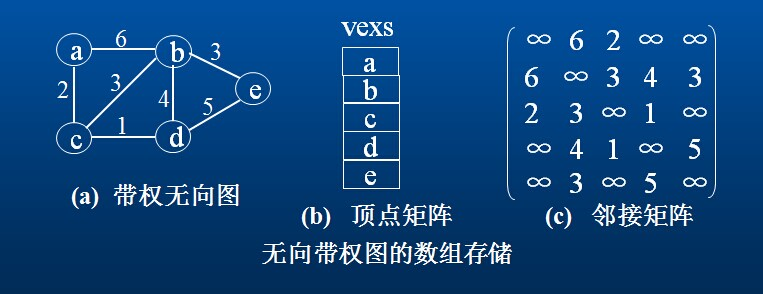
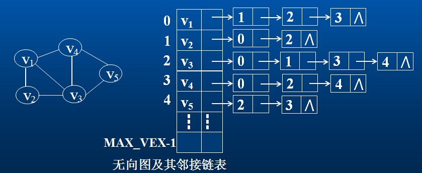
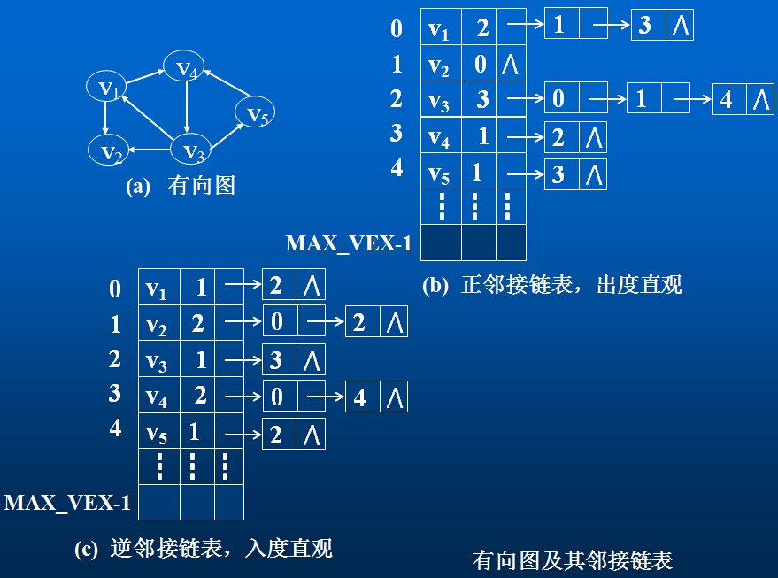

**弧(Arc) ：表示两个顶点v和w之间存在一个关系，用顶点偶对<v,w>表示。通常根据图的顶点偶对将图分为有向图和无向图。**

**权(Weight)：与图的边和弧相关的数。权可以表示从一个顶点到另一个顶点的距离或耗费。**

例1：设有有向图G1和无向图G2，形式化定义分别是： G1=(V1 ，E1)

V1={a,b,c,d,e}
E1={<a,b>,<a,c>, <a,e>,<c,d>,<c,e> ,<d,a>,<d,b>,<e,d>}
G2=(V2 ，E2)
V2={a,b,c,d}
E2={(a,b), (a,c), (a,d), (b,d), (b,c), (c,d)}

##邻接矩阵(数组)表示法

**无权图的邻接矩阵**

**带权图的邻接矩阵**

##邻接链表法

